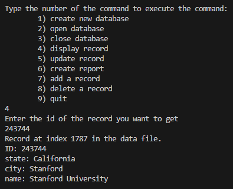
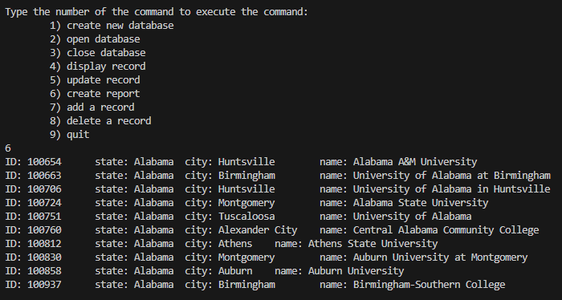

# csv-database
This was a university project where I had to implement a file based database system that uses csv files. This program generates a fixed length data file from a csv to be used as the database.

### Record Data

### First 10 Records

